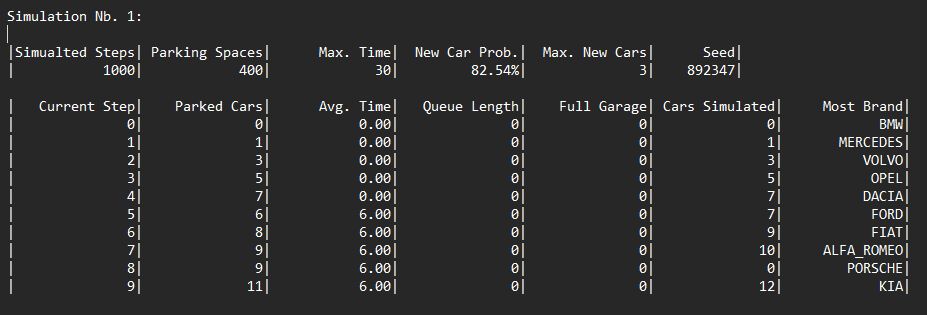
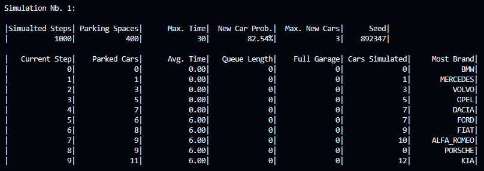

# Overview of planned statistics

## Given data
### Garage
- Number of parking spaces
- Maximum parking duration
- Timestep of simulation
- Probability of a new car arriving
- Maximum amount of cars arriving
- Seed for "randomness"

### Car
- Car ID
- Remaining parking time 
- Time of entering 
- Random parking time (0 - max duration)

This data is needed to determine which statistic can be drawn from it.

## Useful statistic ideas
- Amount of cars currently in the garage
- Average parking time
- Total amount of cars in the garage during the simulation
- Amount of cars in waiting line
- Average waiting time
- Number of times the parkhouse was full
- __Bonus: which car type parked the most__

## File format

The calculated statistics will be put into a __.txt__ file when the simulation is exited. The format will be like this:

## Output format
The priority is to get the code running so the primary output is a terminal output like this:  

----

### Bonus
A secondary goal is to get a GUI running with plotted graphs and buttons to switch between them.  
This is not a graph of data, it's just randomly generated numbers.

## Justification

At first, we thought about a normal parking garage and which data the owner and users would like to have.

We thought about the simplest, yet most elegant way to display the data.
Hence the console output and the file are identical and structured for the best visibility.

We decided that a better visualization for long simulations would also be nice. So we searched across the web for a good solution
to visualize a graph for the data. We found the method of using Dear ImGui, but we didn't like the looks of it, so we decided to use the very basic libraries SDL3 and SDL3_TTF for fonts. This made the Visualization a bit harder, since we needed our own functions for __everything__. The given GUI is also just a basic version, since it was done as fast as possible, to just get an idea of how it will look.
