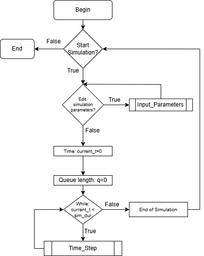
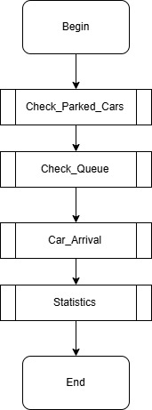
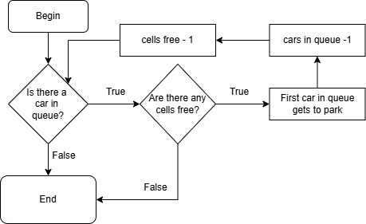
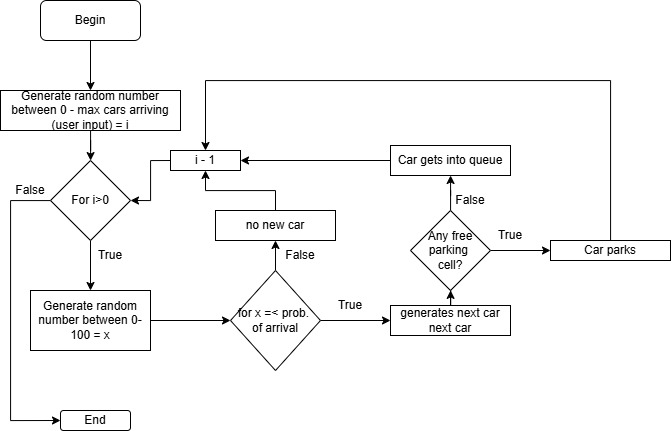

# Simulation steps:

After entering the simulation we loop for all `Time_Steps` specified in `max_timesteps`/`sim_dur`. 

The `Time_Step` function does a few subfunctions: 
1. Check_Parked_Cars
  - Here we check for parked cars to depart
2. Check_Queue
  - If car in queue and cells are free, park car
3. Car_Arrival
  - new cars can arrive and park if queue is empty, otherwise go into queue
4. Statistics
  - Calculate statistics and print table row

In the end we output the final statistics and save them as `.txt`. 
Then we return back to the CLI start menu. 